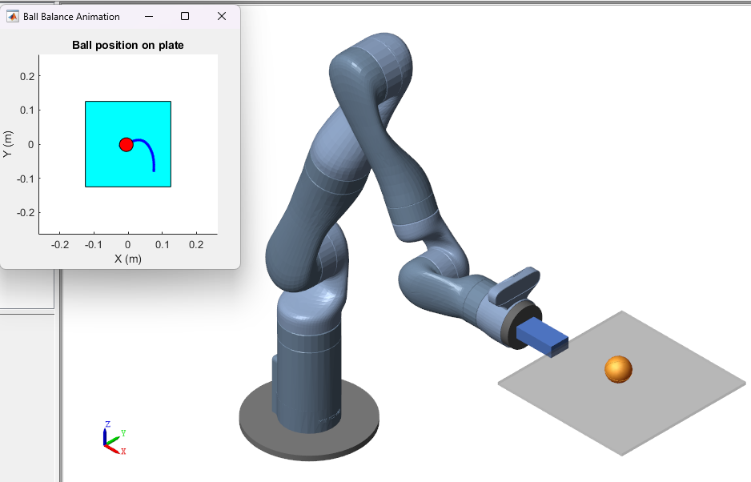

# Train SAC Agent for Ball Balance Control

This project demonstrates how to train a Soft Actor-Critic (SAC) reinforcement learning agent to control a Kinova Gen3 robot arm to perform a ball-balancing task.

---

## Overview

We aim to teach a Kinova Gen3 robot arm with seven degrees of freedom (DOF) to balance a ping pong ball on a flat plate attached to its gripper. The task focuses on utilizing reinforcement learning (RL) techniques to achieve this challenging objective. Although the robot arm has seven DOF, only the final two joints are used for actuation, enabling the robot to control the pitch and roll of the plate. The other joints remain fixed.

---

## Understanding Reinforcement Learning in This Task

In reinforcement learning, the agent (here, the SAC agent) interacts with the environment (the ball and plate system) to learn a strategy that maximizes the long-term reward. The agent makes decisions (actions) based on the current state (observations) and receives feedback in the form of a reward. Over time, the agent improves its strategy through trial and error.

### The RL Setup in This Project

1. **Agent**: The SAC agent, which uses deep neural networks to approximate the optimal policy.
2. **Environment**: The Simulink model of the Kinova Gen3 robot, ball, and plate system.
3. **Observations**: The information the agent receives from the environment to make decisions, including:
   - Joint angles (represented as sine and cosine values), velocities, and torques.
   - The ball's position relative to the plate center and its velocity.
   - The orientation of the plate (represented using quaternions) and its velocity.
   - Physical parameters like the ball's radius and mass.
4. **Actions**: The torques applied to the two actuated joints of the robot arm, normalized between -1 and 1.
5. **Reward Function**: A mathematical expression that provides feedback to the agent on how well it is performing:  
    =  -  - 

   - : A positive reward for keeping the ball near the center of the plate.
   - : A penalty for deviations in plate orientation, ensuring stable control.
   - : A penalty for excessive control effort to encourage efficiency.

---

## Introduction

This example uses a Soft Actor-Critic (SAC) agent. SAC is a reinforcement learning algorithm known for its ability to handle continuous action spaces, which is perfect for controlling the torques of the robot's joints. It uses two components:
- **Critic Networks**: Estimate the value (or expected reward) of the current policy.
- **Actor Network**: Outputs actions as Gaussian-distributed random variables, encouraging exploration.

---

### Simulink Model of the Environment

The Simulink® model represents the physical system using Simscape™ Multibody™ and connects it to the RL agent. The agent applies actions (torques) and receives:
- **Observations**: Details about the ball and plate’s current state.
- **Reward**: Feedback on performance.
- **Is-Done Signal**: Indicates when the episode (simulation) ends, for example, when the ball falls off the plate.

You can explore the model with:
```matlab
open_system("rlKinovaBallBalance")
open_system("rlKinovaBallBalance/Kinova Ball Balance")
```

---

## System Components and Physical Modeling

- **Manipulator, Ball, and Plate**: Simulated using Simscape™ Multibody™ to reflect real-world physics.
- **Contact Forces**: Modeled with the Spatial Contact Force block to capture interactions between the ball and the plate.
- **Visualization**: Use the Mechanics Explorer for a 3D animation. Adjust visualization settings as needed, especially if you do not have the Robotics System Toolbox Robot Library Data support package.

### Initialization and Parameter Setting

Run this script to configure parameters and add necessary files:
```matlab
kinova_params
```

---

## Reinforcement Learning Environment

### Observations and Actions

- **Observations**: A vector of 22 elements that provide details about the ball and plate system.
- **Actions**: Torques applied to the two actuated joints, constrained between -1 and 1.

Define these specifications:
```matlab
nObs = 22; % Observation dimensions
nAct = 2;  % Action dimensions

obsInfo = rlNumericSpec([nObs 1]);
actInfo = rlNumericSpec([nAct 1]);
actInfo.LowerLimit = -1;
actInfo.UpperLimit = 1;
```

### Creating the Environment Interface

Link the Simulink model to the RL environment:
```matlab
mdl = "rlKinovaBallBalance";
blk = mdl + "/RL Agent";
env = rlSimulinkEnv(mdl, blk, obsInfo, actInfo);
env.ResetFcn = @kinovaResetFcn;
```

---

## Designing the SAC Agent

### Critic Neural Network

The critic network estimates the value of the policy:
```matlab
observationPath = [
    featureInputLayer(nObs, Name="observation")
    concatenationLayer(1, 2, Name="concat")
    fullyConnectedLayer(128)
    reluLayer
    fullyConnectedLayer(64)
    reluLayer
    fullyConnectedLayer(32)
    reluLayer
    fullyConnectedLayer(1, Name="QValueOutLyr")
];
actionPath = featureInputLayer(nAct, Name="action");

criticNet = dlnetwork;
criticNet = addLayers(criticNet, observationPath);
criticNet = addLayers(criticNet, actionPath);
criticNet = connectLayers(criticNet, "action", "concat/in2");
```

### Actor Neural Network

The actor network outputs a Gaussian-distributed action:
```matlab
commonPath = [
    featureInputLayer(nObs, Name="observation")
    fullyConnectedLayer(128)
    reluLayer
    fullyConnectedLayer(64)
    reluLayer(Name="commonPath")
];
meanPath = [
    fullyConnectedLayer(32, Name="meanFC")
    reluLayer
    fullyConnectedLayer(nAct, Name="actionMean")
];
stdPath = [
    fullyConnectedLayer(nAct, Name="stdFC")
    reluLayer
    softplusLayer(Name="actionStd")
];

actorNet = dlnetwork;
actorNet = addLayers(actorNet, commonPath);
actorNet = addLayers(actorNet, meanPath);
actorNet = addLayers(actorNet, stdPath);
actorNet = connectLayers(actorNet, "commonPath", "meanFC/in");
actorNet = connectLayers(actorNet, "commonPath", "stdFC/in");
```

### SAC Agent Configuration

Set up the agent options and initialize the SAC agent:
```matlab
agentOpts = rlSACAgentOptions( ...
    SampleTime = Ts, ...
    TargetSmoothFactor = 1e-3, ...
    ExperienceBufferLength = 1e6, ...
    MiniBatchSize = 256, ...
    NumWarmStartSteps = 256 * 10, ...
    DiscountFactor = 0.99);

agent = rlSACAgent(actor, [critic1, critic2], agentOpts);
```

---

## Training the Agent

Configure the training options:
```matlab
trainOpts = rlTrainingOptions( ...
    MaxEpisodes = 6000, ...
    MaxStepsPerEpisode = floor(Tf/Ts), ...
    ScoreAveragingWindowLength = 100, ...
    Plots = "training-progress", ...
    SimulationStorageType = "file", ...
    StopTrainingCriteria = "EvaluationStatistic", ...
    StopTrainingValue = 700, ...
    UseParallel = false);
```

To start or skip training:
```matlab
doTraining = false;
if doTraining
    evaluator = rlEvaluator(EvaluationFrequency = 25, NumEpisodes = 5);
    trainResult = train(agent, env, trainOpts, Logger = logger, Evaluator = evaluator);
else
    load("kinovaBallBalanceAgent.mat");
end
```

---

## Simulating and Visualizing the Trained Agent

Set the conditions and run a simulation:
```matlab
userSpecifiedConditions = true;
simOpts = rlSimulationOptions(MaxSteps = floor(Tf/Ts));
set_param(mdl, SimMechanicsOpenEditorOnUpdate = "on");
doViz = true;
agent.UseExplorationPolicy = false;
experiences = sim(agent, env, simOpts);
```

Visualize the ball's trajectory:
```matlab
fig = animatedPath(experiences);
```

---

## Data Logging

Custom functions for logging agent data:
```matlab
function dataToLog = logAgentLearnData(data)
    dataToLog.ActorLoss = data.ActorLoss;
    dataToLog.CriticLoss = data.CriticLoss;
end

function dataToLog = logEpisodeData(data, doViz)
    dataToLog.Experience = data.Experience;
    if doViz
        animatedPath(data.Experience);
    end
end
```

### What is Happening in Reinforcement Learning Terms

1. **Exploration vs. Exploitation**: The SAC agent uses Gaussian-distributed actions to explore different torque values. Over time, the agent learns which actions yield the highest rewards and adjusts its strategy to exploit this knowledge.
2. **Value Estimation**: The critic networks help the agent understand the value of being in a particular state and taking a specific action. This understanding is crucial for policy improvement.
3. **Continuous Action Space**: Unlike discrete RL problems, controlling torques requires dealing with continuous values. SAC is well-suited for this because it handles continuous action spaces efficiently.
4. **Training Strategy**: The agent learns through thousands of episodes, using a balance between short-term exploration and long-term reward optimization. 

By the end of training, the SAC agent should be proficient at balancing the ball by adjusting the plate's orientation using minimal and efficient control inputs.

---

**Copyright 2021-2024 The MathWorks, Inc.**
